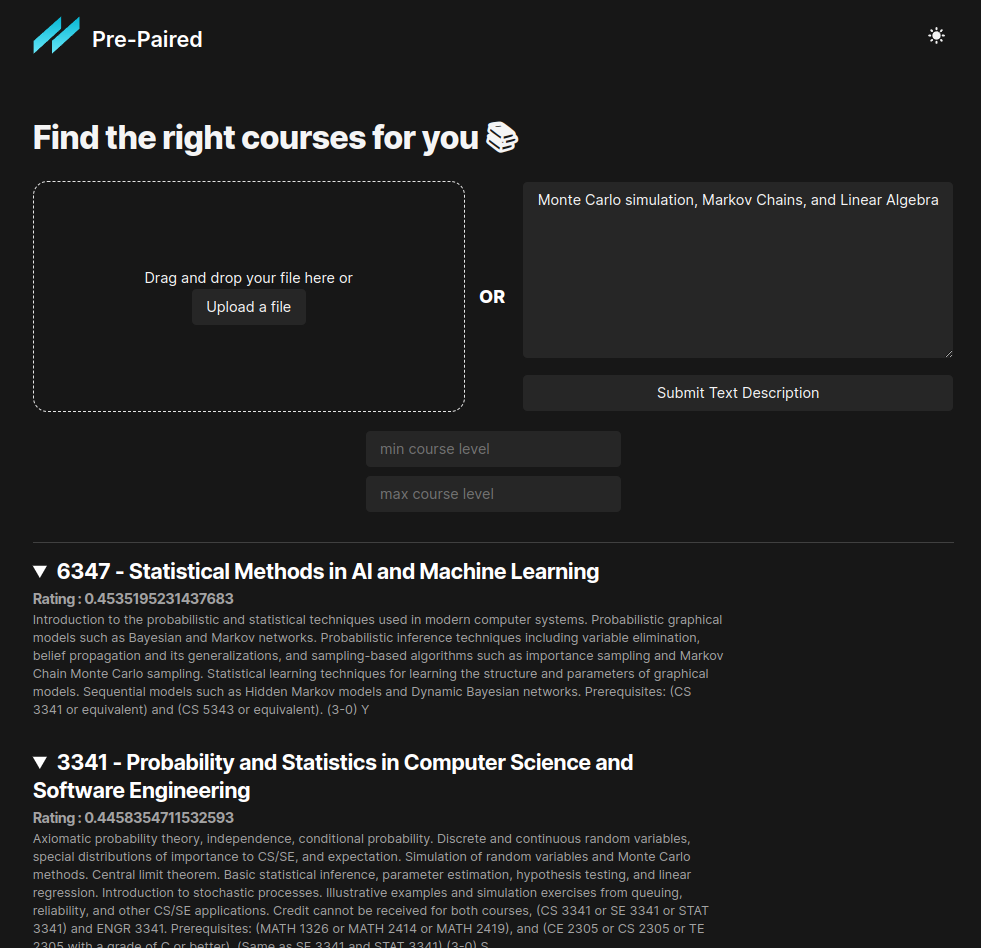

# Pre-Paired

## Inspiration
One of the things I and others in the UTD community may have felt at some point in time is how overwhelmed you can be when registration comes around during the busiest time your semester. You have a project due on Thursday, an exam on Wednesday, and you cant focus because you think you bombed that exam last Friday, but then you realize you havent planned your next semester schedule! In times like these you might want a faster way to find classes that align with a job posting you want to apply for or maybe find classes about a topic you're very strong in. For these reasons we wanted to make an app that provides a more powerful searching system for courses that can process higher-level requests than a typical lexical-search.

## What it does 
`Pre-Paired` was created to be an extensible semantic searching platform for finding University courses which satisfy your career or personal skillset requirements. By submitting text or uploading a text-based file from/about a personal interest, job posting, or other source, we are able to rank and recommend courses using context surrounding course options. It is primarily aimed at students midway through their degrees trying to quickly find elective courses appropriate for their career or personal goals.  

## How we built it 
We used open source models for computing sentence similarity between UTD course descriptions pulled from the Nebula API, and used a python Flask server with a React frontend to deliver data and interactivity to the user in a web app.

## Challenges we ran into
A majority of our issuese were encounted with the dynamic nature of both python and javascript which lead to much slower debugging cycles and errors that puzzled us for longer than we would like to admit. The most prevalent of those issues would have been maintaining consistent api contracts between the frontend and backend, which was a hassle when compared to developing a full stack app in typescript with shared type definitions.

## Accomplishments that we're proud of 
We were very pleased that our first protoype went very smoothly, and it wasn't long into the hackathon that we had a functional command line interface with our backend logic and could already imagine the shape our project was going to take.

## What we learned 
This project was our first contact with any real world application of ML outside of coursework, and it was actually a very pleasant experience with a very active and open community.
We learned to also be flexible in the tools we used to create services, as we needed to use python combined with nodejs to create a dynamic React frontend using parameters provided from a flask server

## What's next 
We can already see paths to follow in order to expand the capabilities of this platform:
- We initially wanted to extend our project with popular known rating sources such as `Rate My Professor`, and think that given a larger window of development time we could have built a system for attribute-based extension of class data
- Consider the times that something catches your eye, but you lack the appropriate background to identify the action, object, or the concept in question. We want to break down this barrier of prior knowledge by also adopting the encoding of non-textual sources such as images or recordings (visual/vocal).

## Snapshots

#### Homepage

#### Plaintext dump from job posting for: _StateFarm Senior Data Engineer - AWS_

#### Searching based on prior knowledge or interest

#### Alternate Light theme
